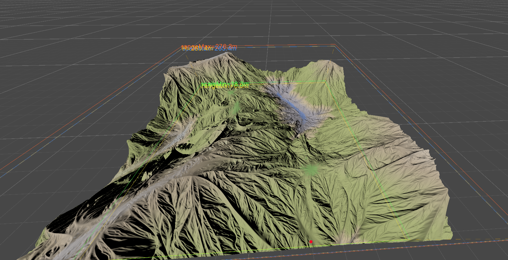

# FullWorld — GPU Procedural Terrain Generator

A **GPU-accelerated procedural terrain generation system** for Unity (HDRP), featuring composable height layers, biome classification, automatic Unity Terrain output, and an in-editor brush painting pipeline.

And you can run it in real time!!! 

---

## 🎬 Preview

<video src="https://github.com/user-attachments/assets/REPLACE_WITH_PREVIEW1_URL.mp4" controls="controls" width="100%"></video>

> **Terrain Lighting** — Real-time light variation across the generated terrain

<video src="https://github.com/user-attachments/assets/REPLACE_WITH_PREVIEW2_URL.mp4" controls="controls" width="100%"></video>

> **Terrain Overview** — Full landscape traversal of the procedurally generated world



> **Editing Tools** — Layer management, biome control, and mask painting in the editor

---

## ✨ Features

- **GPU-Driven Heightmap Generation** — All terrain layers execute via `CommandBuffer` + Compute Shaders on the GPU; zero CPU bottleneck for height computation.
- **Composable Layer System** — Stack arbitrary layers (Heightmap, Erosion, Fill, Paint…) with per-layer enable/mask support. Reorder, duplicate, or swap at any time.
- **5-Zone Biome Classification** — Automatic Water → Sand → Vegetation → Rock → Snow zoning from height + slope, with smooth transitions and slope override.
- **One-Click Unity Terrain** — `GenerateTerrain()` produces a complete `Terrain` object: heightmap, 5-layer alphamap, auto-generated `TerrainLayer`s, and HDRP `TerrainLit` material — fully automatic, zero manual setup.
- **Per-Layer Mask Painting** — GPU-accelerated brush engine for painting per-layer effect masks directly in SceneView (Modify / Smooth / Erase modes, undo support).
- **Biome-Aware Vegetation** — Clustered scatter system places trees/bushes based on biome zone weights and optional per-layer masks.
- **HDRP-First** — Auto-assigns `HDRP/TerrainLit` material; preview mesh uses Shader Graph with vertex-colored biome feedback.

---

## 🏗️ Architecture

```
FullWorldTerrain (ScriptableObject)
│
├─ GenerateWorkflow()          ← GPU pipeline: layers → clamp → biome map
│   ├─ HeightmapLayer          ← Procedural noise heightmap
│   ├─ ErosionLayer            ← Hydraulic + thermal erosion
│   ├─ FillHightMapLayer       ← Fill from texture
│   ├─ PaintHightMapLayer      ← Uniform height paint
│   ├─ ClampHeightCS           ← Quadratic decay + hard range clamp
│   └─ BiomeMapCS              ← Classify each pixel into biome color
│
├─ GenerateTerrain()           ← CPU readback → Unity Terrain
│   ├─ Heightmap → TerrainData.SetHeights()
│   ├─ ComputeBiomeWeights()   ← CPU mirrors GPU biome logic
│   ├─ CreateBiomeTerrainLayers() ← Auto TerrainLayer per zone
│   ├─ 5-layer Alphamap → TerrainData.SetAlphamaps()
│   └─ EnsureTerrainMaterial() ← Auto HDRP/TerrainLit material
│
├─ GenerateVegetation()        ← CPU scatter (biome-weighted)
│
└─ Editor Tools
    ├─ TerrianBaseGerneratorTools   ← Base params & generation trigger
    ├─ TerrianEffectLayerTools      ← Layer reorder/list + mask preview
    ├─ BiomeControlTool             ← Biome thresholds + gradient preview
    ├─ MaskEditSession + MaskBrush  ← GPU brush painting on masks
    └─ FullWorldTerrainEditorStage  ← Blueprint editing mode
```

### Key Data Flow

```
HeightSlopeMap (ARGBFloat RT)
  R = normalized height [0,1]
  G = slope X
  B = slope Y
  A = packed data
        │
        ▼
  ┌─────────────────┐
  │  Terrain Layers  │  (composable, each modifies HeightSlopeMap)
  └────────┬────────┘
           ▼
  ClampHeightCS (quadratic decay + range clamp)
           │
           ▼
  BiomeMapCS → BiomeMap (ARGBFloat RT, visual preview colors)
           │
     ┌─────┴─────┐
     ▼            ▼
  Preview Mesh   GenerateTerrain()
  (vertex colors)  ├─ CPU ComputeBiomeWeights(height, slope)
                  ├─ 5-layer alphamap (Water/Sand/Veg/Rock/Snow)
                  ├─ Auto TerrainLayer[] + HDRP material
                  └─ Unity Terrain component
```

---

## 🚀 Quick Start

1. **Create** a `FullWorldTerrain` asset via `Assets > Create > Full World Generator > Procedural Terrain`.
2. **Configure** layers, biome thresholds, and height range in the Inspector.
3. **Generate** — click **"Generate Terrain"** or call from code:

```csharp
var terrain = FindObjectOfType<FullWorldTerrain>();
terrain.GenerateTerrain();   // Full pipeline: GPU → CPU readback → Unity Terrain
terrain.GenerateVegetation(); // Optional: scatter trees/bushes
```

That's it. A complete `Terrain` object appears in the scene with:
- ✅ Correct heightmap
- ✅ 5 biome-zone TerrainLayers with alphamap blending
- ✅ HDRP TerrainLit material assigned automatically

---

## ⚙️ Biome System

Height-based zone thresholds in normalized `[0, 1]` space:

| Zone        | Parameter         | Default |
|-------------|-------------------|---------|
| Water       | `waterLine`       | 0.20    |
| Sand        | `sandEnd`         | 0.28    |
| Vegetation  | `vegetationEnd`   | 0.60    |
| Rock        | `rockEnd`         | 0.85    |
| Snow        | `snowStart`       | 0.85    |
| Slope→Rock  | `rockSlopeStart`  | 0.30    |
| Slope→Rock  | `rockSlopeEnd`    | 0.70    |

Steep slopes override to rock regardless of height zone (matching real terrain behavior). Zone boundaries produce smooth blends, not hard cuts.

---

## 🎨 Terrain Layers

Each layer is a `ScriptableObject` parameter + enable toggle + optional mask:

| Layer              | Description                              |
|--------------------|------------------------------------------|
| `HeightmapLayer`   | Multi-octave noise heightmap generation  |
| `ErosionLayer`     | Hydraulic + thermal erosion simulation   |
| `FillHightMapLayer`| Fill height from a texture               |
| `PaintHightMapLayer`| Paint uniform height values              |

Add, remove, reorder, and toggle layers freely. Per-layer masks can be painted in the editor using the GPU brush tool.

---

## 🖌️ Brush / Mask Painting

The editor provides a GPU-accelerated painting system for per-layer effect masks:

- **3 modes**: Modify (paint), Smooth, Erase
- **GPU-based**: `GpuBrushEngine` compute shader for real-time performance
- **Undo**: 6-level undo stack for stroke corrections
- **Live preview**: Brush circle overlay in SceneView

---

## 🌿 Vegetation

`GenerateVegetation()` scatters instances using biome zone weights:

- Trees and bushes placed by density/bushRatio per layer
- Biome zone filtering (e.g. trees only in Vegetation zone)
- Per-layer mask support for fine control
- Clustered distribution for natural-looking placement

---

## 📁 Project Structure

```
Assets/Full World Generator/
├─ Runtime/
│  ├─ Core/
│  │  ├─ FullWorldTerrain.cs          ← Main SO: generation pipeline
│  │  ├─ Data/
│  │  │  ├─ BaseTerrianLayer.cs        ← Abstract layer base
│  │  │  ├─ BaseMaskData.cs            ← Mask ScriptableObject
│  │  │  ├─ *LayerParam.cs            ← Layer parameter SOs
│  │  ├─ Layer/
│  │  │  ├─ HeightmapLayer.cs         ← Noise heightmap
│  │  │  ├─ ErosionLayer.cs           ← Erosion simulation
│  │  │  ├─ FillHightMapLayer.cs      ← Texture fill
│  │  │  ├─ PaintHightMapLayer.cs     ← Height paint
│  │  ├─ Vegetation/
│  │     ├─ VegetationScatterer.cs     ← Scatter algorithm
│  │     ├─ VegetationData.cs          ← Instance types & params
│  │     ├─ VegetationMeshBuilder.cs  ← Editor preview meshes
│  └─ Resources/Shader/
│     ├─ BiomeMapCS.compute           ← Biome classification
│     ├─ ClampHeightCS.compute        ← Height decay/clamp
│     ├─ TerrainErosionCS.compute      ← Erosion simulation
│     ├─ FillHeightmapCS.compute      ← Texture fill
│     ├─ PaintHeightmapCS.compute      ← Height paint
│     ├─ M_TerrianDebug.shadergraph   ← Preview shader
│     └─ Include/
│        ├─ TerrainNoise.hlsl
│        └─ TerrainErosion.hlsl
│
└─ Editor/
   ├─ FullWorldTerrainEditor.cs       ← Main custom editor
   ├─ Common/
   │  ├─ EditorTools/
   │  │  ├─ BiomeControlTool.cs       ← Biome + vegetation UI
   │  │  ├─ TerrianEffectLayerTools.cs← Layer list + mask
   │  │  ├─ TerrianBaseGerneratorTools.cs
   │  ├─ Brush/
   │  │  ├─ MaskBrushTool.cs          ← Brush painting tool
   │  │  ├─ MaskEditSession.cs        ← Undo + session
   │  │  ├─ ScreenSpaceBrush/         ← GPU brush engine
   │  ├─ Stage/
   │  │  └─ FullWorldTerrainEditorStage.cs
   │  └─ EditorModeRender/
   │     └─ TerrianMeshRender.cs      ← Preview mesh renderer
   └─ Debug/
      └─ TerrainErosionDebugWindow.cs
```

---

## 📋 Requirements

- **Unity** 2021.2+ (UI Toolkit, Shader Graph)
- **HDRP** 12+ (project uses HDRP/TerrainLit（can Replaced）)
- **Unity.Mathematics**

---

## 🙏 Acknowledgements
- Erosion simulation based on hydraulic/thermal erosion research
